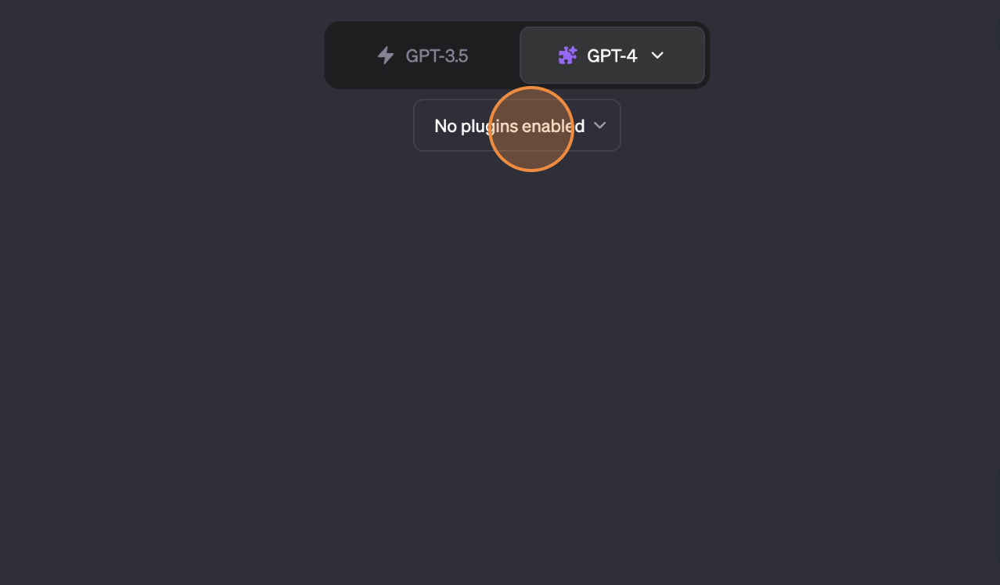
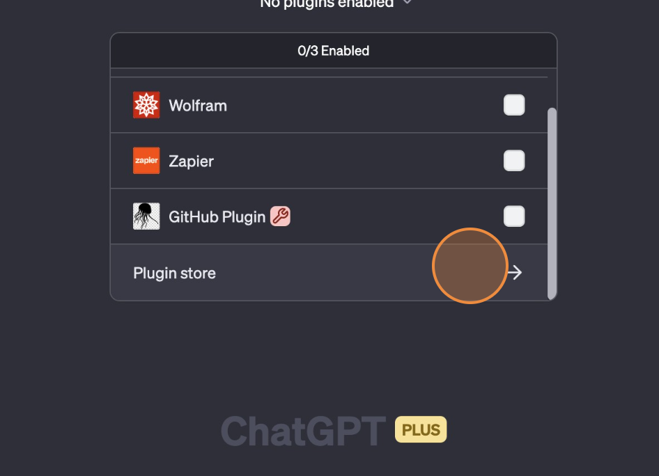
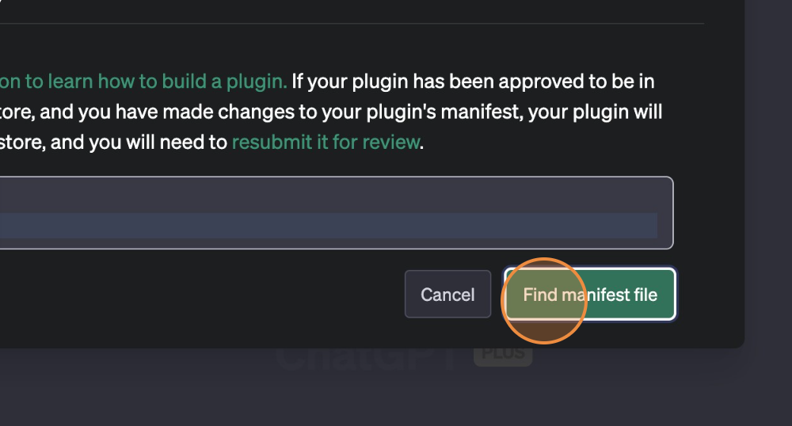
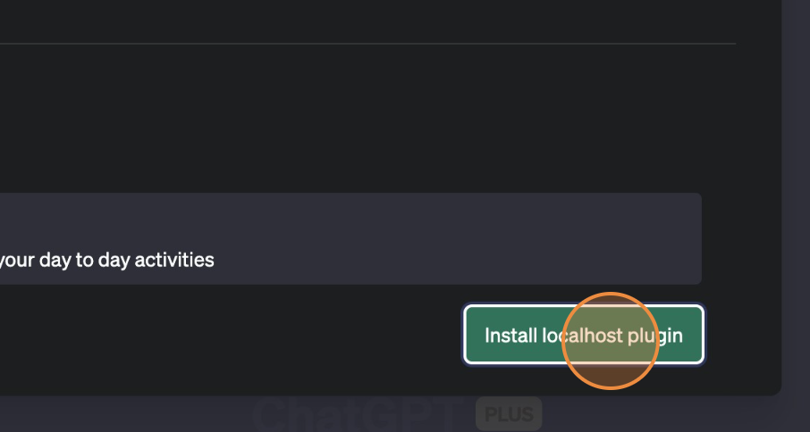

# Extending ChatGPT with AIgenda Functionality

## Prerequisites

- Access to the OpenAI GPT-Plus. As of now, plugins are only available to GPT plus members.
- Running instance of AIgenda

## Steps

1. **Log in to your OpenAI ChatGPT Plus account**

   Navigate to the OpenAI website and log in to your account.

2. **Enable Plugins**

   Once you're logged in, look for the "Enable Plugins" option and select it.

   

3. **Access the Plugin Store**

   Next, select the "Plugin Store" option to view available plugins.

   

4. **Find the Plugin Manifest**

   In the Plugin Store, enter the URL for the plugin you want to install (for example, `localhost:8080`) in the appropriate field, then select "Find Manifest".

   

5. **Install the Plugin**

   Finally, select "Install Plugin" to add the plugin to your ChatGPT Plus.

   
